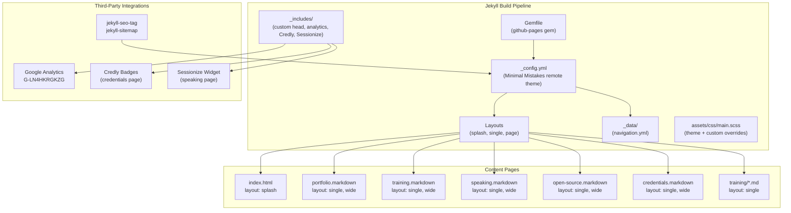

# Design Document: Website Redesign

## Overview

This design describes the comprehensive redesign of Elena van Engelen-Maslova's freelance professional website from a CV-style Jekyll site using the default Minima theme into a modern, client-acquisition-focused site using the Minimal Mistakes theme. The redesign touches every page, restructures navigation, adds a new Open Source page, and rewrites content with sales-oriented copy — all while preserving existing SEO, analytics, third-party integrations, and GitHub Pages compatibility.

### Key Design Decisions

1. **Theme: Minimal Mistakes via remote_theme** — Rather than heavily customizing Minima or building from scratch, we adopt Minimal Mistakes. It is 100% compatible with GitHub Pages as a remote theme, provides built-in responsive layouts (splash, single, archive), feature rows, header overlays, author profiles, and card-based styling out of the box. This eliminates the need to write custom CSS for layout primitives. The `remote_theme` approach avoids Gemfile whitelisting issues on GitHub Pages.

2. **Homepage as splash layout** — The Minimal Mistakes `splash` layout provides full-width header overlays with CTA buttons and `feature_row` blocks, which map directly to the hero section and service pillar requirements. No custom layout needed.

3. **Custom CSS layer for brand refinements** — A custom `assets/css/main.scss` file will import the theme's Sass and add overrides for the Inter font stack, social proof strip styling, and minor spacing adjustments. This keeps customizations minimal and maintainable.

4. **Preserve all permalinks** — Every existing page keeps its current `permalink` front matter value. The new Open Source page gets `/open-source/`. No existing URLs change.

5. **Content-first approach** — Each page's Markdown content is rewritten in place. The theme handles visual presentation through layouts and front matter configuration, so the migration is primarily a theme swap + content rewrite rather than a structural rebuild.

## Architecture

### High-Level Site Architecture



### Theme Migration Strategy

The migration from Minima to Minimal Mistakes follows this approach:

1. **Gemfile**: Replace `gem "minima"` and `gem "jekyll"` with `gem "github-pages"` and add `gem "jekyll-include-cache"`.
2. **_config.yml**: Replace `theme: minima` with `remote_theme: "mmistakes/minimal-mistakes@4.28.0"`. Add `jekyll-include-cache` to plugins. Configure Minimal Mistakes-specific settings (skin, author profile, footer links, defaults).
3. **Navigation**: Replace `header_pages` with `_data/navigation.yml` using Minimal Mistakes' masthead navigation system.
4. **Layouts**: Remove custom `_layouts/home.html`. Use theme-provided layouts: `splash` for homepage, `single` with `classes: wide` for content pages.
5. **Includes**: Remove Minima-specific includes (`_includes/header.html`, `_includes/footer.html`, `_includes/social.html`, `_includes/head.html`). Keep `_includes/google-analytics.html` and move it into Minimal Mistakes' `_includes/head/custom.html` hook. Credly and Sessionize scripts remain inline in their respective page Markdown.
6. **Styling**: Create `assets/css/main.scss` that imports the theme and adds custom overrides.

### Deployment Compatibility

- **GitHub Pages**: The `remote_theme` directive is natively supported by GitHub Pages. The `github-pages` gem bundles all whitelisted plugins.
- **Local development**: `bundle exec jekyll serve` works with the `github-pages` gem. The `jekyll-remote-theme` plugin (bundled in `github-pages`) fetches the theme at build time.
- **Plugins used**: `jekyll-seo-tag`, `jekyll-sitemap`, `jekyll-feed`, `jekyll-include-cache` — all GitHub Pages whitelisted or bundled.

## Components and Interfaces

### 1. Configuration (`_config.yml`)

The central configuration file is restructured for Minimal Mistakes:

```yaml
# Site settings
title: Elena van Engelen-Maslova
subtitle: "Kotlin & Cloud-Native Consultant · Trainer · Speaker"
name: Elena van Engelen-Maslova
email: elenavanengelen@vintik.nl
description: >-
  Freelance Kotlin and cloud-native consultant helping teams build scalable
  systems on AWS and Azure. Corporate training, conference speaking, and
  hands-on engineering.
url: "https://elenavanengelenmaslova.github.io"
repository: "elenavanengelenmaslova/elenavanengelenmaslova.github.io"

# Theme
remote_theme: "mmistakes/minimal-mistakes@4.28.0"
minimal_mistakes_skin: "default"  # clean, professional look

# Author profile (shown in sidebar)
author:
  name: "Elena van Engelen-Maslova"
  avatar: "/assets/images/profile.jpeg"
  bio: "Freelance Kotlin & Cloud-Native Consultant. Author of *Kotlin Crash Course*. AWS Community Builder."
  location: "Netherlands"
  links:
    - label: "Email"
      icon: "fas fa-fw fa-envelope"
      url: "mailto:elenavanengelen@vintik.nl"
    - label: "LinkedIn"
      icon: "fab fa-fw fa-linkedin"
      url: "https://www.linkedin.com/in/elena-van-engelen-maslova/"
    - label: "GitHub"
      icon: "fab fa-fw fa-github"
      url: "https://github.com/elenavanengelenmaslova"
    - label: "Mastodon"
      icon: "fab fa-fw fa-mastodon"
      url: "https://hachyderm.io/@elenavanengelen"

# Analytics
analytics:
  provider: "google-gtag"
  google:
    tracking_id: "G-LN4HKRGKZG"

# SEO
plugins:
  - jekyll-sitemap
  - jekyll-seo-tag
  - jekyll-feed
  - jekyll-include-cache

# Front matter defaults
defaults:
  - scope:
      path: ""
    values:
      layout: "single"
      author_profile: true
  - scope:
      path: ""
      type: "posts"
    values:
      layout: "single"
      author_profile: true

# Footer
footer:
  links:
    - label: "LinkedIn"
      icon: "fab fa-fw fa-linkedin"
      url: "https://www.linkedin.com/in/elena-van-engelen-maslova/"
    - label: "GitHub"
      icon: "fab fa-fw fa-github"
      url: "https://github.com/elenavanengelenmaslova"
    - label: "Mastodon"
      icon: "fab fa-fw fa-mastodon"
      url: "https://hachyderm.io/@elenavanengelen"
```

### 2. Navigation (`_data/navigation.yml`)

Minimal Mistakes uses a data file for masthead navigation instead of `header_pages`:

```yaml
main:
  - title: "Portfolio"
    url: /portfolio/
  - title: "Training"
    url: /training/
  - title: "Speaking"
    url: /speaking/
  - title: "Open Source"
    url: /open-source/
  - title: "Credentials"
    url: /credentials/
  - title: "Blog"
    url: "https://medium.com/@elenavanengelen"
    target: "_blank"
    rel: "noopener"
```

### 3. Homepage (`index.html`)

Converted from Markdown to HTML front matter to leverage the `splash` layout with `feature_row`:

```yaml
---
layout: splash
permalink: /
header:
  overlay_color: "#1a1a2e"
  overlay_filter: "0.6"
  overlay_image: /assets/images/profile.jpeg
  actions:
    - label: "Get in Touch"
      url: "mailto:elenavanengelen@vintik.nl"
excerpt: >
  Helping teams build scalable Kotlin and cloud-native systems on AWS and Azure.
  Consulting · Training · Speaking
feature_row:
  - title: "Consulting"
    excerpt: "Hands-on Kotlin and cloud-native engineering for your team. I embed with enterprise teams to design and deliver event-driven, serverless, and microservice architectures on AWS and Azure."
    url: "/portfolio/"
    btn_label: "View Portfolio"
    btn_class: "btn--primary btn--large"
  - title: "Training"
    excerpt: "Practical, outcome-focused Kotlin training from €2,000/day. Your team learns by building real systems — from Kotlin basics to serverless cloud on AWS and Azure."
    url: "/training/"
    btn_label: "Explore Training"
    btn_class: "btn--primary"
  - title: "Speaking"
    excerpt: "Engaging conference talks with live coding on Kotlin and serverless cloud. Featured at KotlinConf, Voxxed Days, InfoQ Dev Summit, and more."
    url: "/speaking/"
    btn_label: "Book a Talk"
    btn_class: "btn--primary"
---
```

The homepage body content (below front matter) includes:
- Social proof strip with client logos/names (PostNL, Bol.com, KPN, AZL/NN Group)
- Credibility indicators (book author, AWS Community Builder, certifications, conference speaker)
- Availability note (project work from April 2027, training/speaking now)
- Secondary CTA

### 4. Training Page (`training.markdown`)

Uses `layout: single` with `classes: wide`. Content restructured to lead with outcomes and social proof:

- Outcome-oriented headline and value proposition
- Student testimonials moved to top (above course listings)
- Pricing: "Starting from €2,000 per day for corporate training"
- Logistics: remote worldwide, on-site in Europe, travel costs for outside NL
- Training client list (AZL/NN Group, Version 1, EDSN)
- Course listings with links to detail pages
- CTA buttons ("Book a Call")

### 5. Training Detail Pages (`training/*.md`)

Each detail page uses `layout: single`. Content reframed:
- Lead with "What your team will be able to do" instead of "Learning Objectives"
- Add CTA button at top and bottom ("Book This Training")
- Retain course structure and content details

### 6. Speaking Page (`speaking.markdown`)

Uses `layout: single` with `classes: wide`. Restructured for conference organizers:

- Speaker bio section (concise, copy-paste ready for organizers)
- Available talk topics with formats (keynote, session, workshop, live coding demo)
- "What you get" section (audience experience, live coding, practical content)
- Speaking metrics (Voxxed Days top 4 most-viewed)
- Availability statement (paid and unpaid at select conferences)
- Sessionize widget preserved (inline script)
- Past recorded talks with video links
- CTA for organizers ("Invite Me to Speak" → mailto)

### 7. Open Source Page (`open-source.markdown`) — NEW

Uses `layout: single` with `classes: wide`. Structure supports multiple projects:

- Page intro explaining open source involvement
- MockNest Serverless as first project entry:
  - Description: serverless WireMock-compatible mock runtime for AWS with AI-powered mock generation
  - GitHub link: https://github.com/elenavanengelenmaslova/mocknest-serverless
  - Key features list
  - Tech stack
  - Award: Creative Track Award, AWS 10,000 AIdeas Competition (text only, no badge)
- CTA: "Explore on GitHub"
- Structure uses heading + description pattern that scales to additional projects

### 8. Portfolio Page (`portfolio.markdown`)

Uses `layout: single` with `classes: wide`. Descriptions tightened to impact-first format:

- Each project: Client name, Role, Key business outcome (1-2 sentences), Technologies
- Removes lengthy problem/solution/impact narratives
- Adds MockNest Serverless cross-reference linking to Open Source page
- Retains all four clients: AZL/NN Group, PostNL, Bol.com, KPN

### 9. Credentials Page (`credentials.markdown`)

Uses `layout: single` with `classes: wide`. Minimal changes:
- Credly badge scripts preserved inline
- Azure certification images preserved
- Academic achievements preserved
- Styling adjusted to work with Minimal Mistakes (flex layouts remain as inline styles)

### 10. Custom Styling (`assets/css/main.scss`)

```scss
---
# Only the main Sass file needs front matter dashes
---

@import "minimal-mistakes/skins/{{ site.minimal_mistakes_skin | default: 'default' }}";
@import "minimal-mistakes";

// Custom font stack
html {
  font-family: "Inter", -apple-system, BlinkMacSystemFont, "Segoe UI", Roboto,
    "Helvetica Neue", Arial, sans-serif;
}

// Social proof strip
.social-proof-strip {
  display: flex;
  flex-wrap: wrap;
  justify-content: center;
  align-items: center;
  gap: 2rem;
  padding: 2rem 0;
  border-top: 1px solid #eee;
  border-bottom: 1px solid #eee;
  margin: 2rem 0;

  span {
    font-size: 1.1rem;
    font-weight: 600;
    color: #555;
  }
}

// CTA button enhancements
.btn--cta {
  font-size: 1.1rem;
  padding: 0.75rem 1.5rem;
}
```

### 11. Google Analytics Integration

Minimal Mistakes has built-in Google Analytics support via `_config.yml`:

```yaml
analytics:
  provider: "google-gtag"
  google:
    tracking_id: "G-LN4HKRGKZG"
```

This replaces the custom `_includes/google-analytics.html` include. The theme handles the gtag.js injection automatically. The custom include file can be removed.

### 12. Include Files Cleanup

**Remove** (replaced by theme):
- `_includes/header.html` — Minimal Mistakes provides its own masthead
- `_includes/footer.html` — Minimal Mistakes provides its own footer
- `_includes/social.html` — Minimal Mistakes handles social links via `_config.yml`
- `_includes/head.html` — Minimal Mistakes provides its own head with SEO

**Remove** (functionality moved to theme config):
- `_includes/google-analytics.html` — handled by `analytics` config

**Remove** (replaced by theme):
- `_layouts/home.html` — replaced by `splash` layout
- `assets/minima-social-icons.svg` — Minimal Mistakes uses Font Awesome

**Keep/Create**:
- `_includes/head/custom.html` — for any additional head tags (favicon)

### 13. Favicon Preservation

Create `_includes/head/custom.html`:

```html
<link rel="icon" href="{{ '/assets/images/logo.png' | relative_url }}" type="image/png">
```

## Data Models

This is a static Jekyll site with no database or dynamic data store. The "data models" are the front matter structures and data files that Jekyll processes at build time.

### Page Front Matter Schema

**Homepage (splash layout)**:
```yaml
layout: splash
permalink: /
header:
  overlay_color: string     # hex color for overlay
  overlay_filter: string    # opacity value
  overlay_image: string     # path to background image
  actions:                  # CTA buttons in header
    - label: string
      url: string
excerpt: string             # tagline text displayed in overlay
feature_row:                # service pillar cards
  - title: string
    excerpt: string
    url: string
    btn_label: string
    btn_class: string
```

**Content pages (single layout)**:
```yaml
layout: single
title: string
permalink: string           # must match existing permalink
classes: wide               # optional, for full-width content
author_profile: true|false  # show/hide sidebar author profile
```

**Training detail pages**:
```yaml
layout: single
title: string
permalink: /training/{slug}/  # must match existing permalink
```

### Navigation Data (`_data/navigation.yml`)

```yaml
main:                       # masthead navigation
  - title: string           # display text
    url: string             # relative or absolute URL
    target: string          # optional, "_blank" for external
    rel: string             # optional, "noopener" for external
```

### Author Data (in `_config.yml`)

```yaml
author:
  name: string
  avatar: string            # path to profile image
  bio: string               # short bio (Markdown supported)
  location: string
  links:                    # social/contact links
    - label: string
      icon: string          # Font Awesome class
      url: string
```

### File Structure After Migration

```
.
├── _config.yml                    # Updated for Minimal Mistakes
├── _data/
│   └── navigation.yml             # NEW: masthead navigation
├── _includes/
│   └── head/
│       └── custom.html            # NEW: favicon + any custom head tags
├── assets/
│   ├── css/
│   │   └── main.scss              # NEW: theme import + custom overrides
│   └── images/                    # UNCHANGED: all existing images
│       ├── profile.jpeg
│       ├── logo.png
│       └── ...
├── Gemfile                        # Updated: github-pages gem
├── index.html                     # CHANGED: .markdown → .html, splash layout
├── portfolio.markdown             # UPDATED: impact-first content
├── training.markdown              # UPDATED: outcome-oriented content
├── speaking.markdown              # UPDATED: organizer-focused content
├── open-source.markdown           # NEW: open source showcase
├── credentials.markdown           # MINOR UPDATES: styling compatibility
├── training/
│   ├── kotlin-basics.md           # UPDATED: outcome framing + CTA
│   ├── kotlin-crash-course.md     # UPDATED: outcome framing + CTA
│   ├── kotlin-aws-lambda.md       # UPDATED: outcome framing + CTA
│   ├── kotlin-azure-functions.md  # UPDATED: outcome framing + CTA
│   └── bite-size-kotlin.md        # UPDATED: outcome framing + CTA
├── 404.html                       # UPDATED: use default layout from theme
└── README.md                      # UNCHANGED
```

**Removed files** (replaced by theme):
- `_includes/header.html`
- `_includes/footer.html`
- `_includes/social.html`
- `_includes/head.html`
- `_includes/google-analytics.html`
- `_layouts/home.html`
- `assets/minima-social-icons.svg`


## Error Handling

### Build Errors

Since this is a static site built by Jekyll, errors manifest at build time rather than runtime.

| Error Scenario | Detection | Resolution |
|---|---|---|
| **Remote theme fetch failure** | `bundle exec jekyll serve` fails with theme download error | Verify internet connectivity; pin theme version in `remote_theme` directive; fall back to gem-based install if persistent |
| **Missing include file** | Jekyll build error: "Could not locate the included file" | Ensure all referenced includes exist; Minimal Mistakes provides its own includes, so remove Minima-specific references |
| **Invalid front matter** | Jekyll build error with YAML parse failure | Validate YAML syntax in front matter; use quotes around strings with special characters |
| **Plugin not found** | Bundler/Jekyll error for missing gem | Ensure all plugins are listed in Gemfile and `_config.yml` plugins array; use only GitHub Pages whitelisted plugins |
| **Broken permalink** | 404 on previously working URL | Verify `permalink` front matter matches original value on every existing page; test all existing URLs after migration |
| **Credly/Sessionize script failure** | Third-party widget doesn't render | Scripts are loaded client-side; ensure inline `<script>` tags are preserved exactly in page Markdown; no Jekyll processing needed |
| **Google Analytics not firing** | No data in GA dashboard | Verify `analytics.google.tracking_id` in `_config.yml`; check that `JEKYLL_ENV=production` is set for production builds (GA is typically gated on environment) |
| **Image not found** | Broken image on page | Verify image paths use `{{ '/assets/images/...' | relative_url }}` or correct relative paths; ensure all images are committed |

### Graceful Degradation

- **Font loading**: The Inter font is loaded via the CSS font stack. If it fails to load (no CDN dependency — it's a system font fallback chain), the browser falls back to `-apple-system`, `BlinkMacSystemFont`, `Segoe UI`, etc.
- **Feature rows**: If `feature_row` front matter is malformed, the splash layout renders without the feature blocks but doesn't break the page.
- **External links**: The Blog link to Medium opens in a new tab. If Medium is down, the link still works — it's just a standard `<a>` tag.
- **Sessionize widget**: If Sessionize's API is unavailable, the widget area is simply empty. The rest of the page renders normally.
- **Credly badges**: Same as Sessionize — client-side JavaScript that degrades to empty space if the CDN is unreachable.

## Testing Strategy

### Why Property-Based Testing Does Not Apply

This feature is a static website redesign involving theme configuration, content rewriting, HTML/CSS layout, and third-party widget integration. There are no pure functions, parsers, serializers, data transformations, or algorithms with meaningful input variation. The acceptance criteria describe:

- **Visual presentation** — theme, fonts, responsive layouts (best tested with visual inspection and snapshot tests)
- **Content presence** — specific text, sections, and links on pages (best tested with example-based HTML assertions)
- **Configuration correctness** — Jekyll builds, plugin compatibility (best tested with smoke tests)
- **Integration preservation** — Google Analytics, Credly, Sessionize scripts present in output (best tested with example-based HTML assertions)

None of these criteria can be meaningfully expressed as "for all inputs X, property P(X) holds." Property-based testing is not appropriate for this feature.

### Testing Approach

#### 1. Build Smoke Tests

Verify the site builds without errors at each milestone:

```bash
# Must exit 0 with no errors
JEKYLL_ENV=production bundle exec jekyll build
```

**What this validates**: Requirements 10.1, 10.2, 10.4, 10.5

#### 2. HTML Output Assertions

After building the site, inspect the generated HTML in `_site/` to verify content and structure. These are example-based tests that check specific elements exist in the rendered output.

**Homepage (`_site/index.html`)**:
- Contains hero section text (value proposition)
- Contains CTA link with `mailto:` or contact URL
- Contains three service pillar sections (Consulting, Training, Speaking)
- Contains social proof names: PostNL, Bol.com, KPN, AZL
- Contains availability note text
- Contains credibility indicators (Kotlin Crash Course, AWS Community Builder, KotlinConf)
- Contains profile image reference (`profile.jpeg`)
- Validates: Requirements 3.1–3.8, 9.1, 9.2

**Navigation (all pages)**:
- Masthead contains links: Portfolio, Training, Speaking, Open Source, Credentials, Blog
- Blog link has `target="_blank"` and `rel="noopener"`
- Open Source link points to `/open-source/`
- Validates: Requirements 2.1–2.4

**Training page (`_site/training/index.html`)**:
- Contains pricing text "€2,000"
- Contains testimonial text
- Contains CTA link text ("Book a Call" or similar)
- Contains training client names (AZL, Version 1, EDSN)
- Contains links to training detail pages
- Contains travel/remote availability text
- Validates: Requirements 4.1–4.8

**Speaking page (`_site/speaking/index.html`)**:
- Contains speaker bio section
- Contains talk topics with format descriptions
- Contains Sessionize script tag (`sessionize.com`)
- Contains CTA mailto link
- Contains "top 4 most-viewed" or equivalent metric text
- Contains video links for past talks
- Validates: Requirements 6.1–6.8

**Open Source page (`_site/open-source/index.html`)**:
- Contains "MockNest Serverless" text
- Contains GitHub repository link
- Contains key features (WireMock-compatible, AI mock generation, SAR deployment)
- Contains tech stack (Kotlin, AWS Lambda, Bedrock, etc.)
- Contains "Creative Track Award" text
- Contains CTA link to GitHub
- Validates: Requirements 7.1–7.5

**Portfolio page (`_site/portfolio/index.html`)**:
- Contains all four client names: AZL, PostNL, Bol.com, KPN
- Contains MockNest Serverless cross-reference with link to `/open-source/`
- Project descriptions are concise (impact-first format)
- Validates: Requirements 8.1–8.4

**Credentials page (`_site/credentials/index.html`)**:
- Contains Credly script tag (`credly.com`)
- Contains Azure certification images
- Contains academic degree information
- Validates: Requirements 1.8

#### 3. Permalink Preservation Tests

After building, verify that all existing URLs produce output files:

```
_site/index.html          → /
_site/portfolio/index.html → /portfolio/
_site/training/index.html  → /training/
_site/speaking/index.html  → /speaking/
_site/credentials/index.html → /credentials/
_site/training/kotlin-basics/index.html → /training/kotlin-basics/
_site/training/kotlin-crash-course/index.html → /training/kotlin-crash-course/
_site/training/kotlin-aws-lambda/index.html → /training/kotlin-aws-lambda/
_site/training/kotlin-azure-functions/index.html → /training/kotlin-azure-functions/
_site/training/bite-size-kotlin/index.html → /training/bite-size-kotlin/
_site/open-source/index.html → /open-source/ (new)
_site/404.html → /404.html
```

**What this validates**: Requirement 10.3

#### 4. SEO and Analytics Verification

- Built HTML contains `<meta>` tags from jekyll-seo-tag (title, description, og:tags)
- `_site/sitemap.xml` exists and contains all page URLs
- Built HTML contains Google Analytics tracking script with ID `G-LN4HKRGKZG`
- Favicon link tag references `assets/images/logo.png`

**What this validates**: Requirements 1.6, 1.7, 10.6

#### 5. Accessibility Checks

- All `` tags have `alt` attributes
- Heading hierarchy is sequential (no skipped levels)
- Semantic HTML elements used (`<nav>`, `<main>`, `<header>`, `<footer>`)

**What this validates**: Requirement 10.7

#### 6. Responsive Layout Verification

Manual testing at three breakpoints using browser dev tools:
- Desktop (1200px+)
- Tablet (768px)
- Mobile (375px)

Verify that navigation collapses to hamburger menu on mobile, feature rows stack vertically, and content remains readable.

**What this validates**: Requirements 1.4, 2.4

#### 7. Visual Review Milestones

The user wants to review the site visually at each milestone using `bundle exec jekyll serve`. The implementation should be structured so that each major change (theme swap, homepage, training page, etc.) produces a locally testable state.

**Milestone sequence**:
1. Theme swap + config + navigation (site builds with new theme, all pages render)
2. Homepage redesign (splash layout with hero, service pillars, social proof)
3. Training page + detail pages (outcome-oriented content, pricing, CTAs)
4. Speaking page (organizer-focused, bio section, Sessionize preserved)
5. Open Source page (new page, MockNest Serverless)
6. Portfolio page (impact-first descriptions, cross-reference)
7. Final polish (credentials, 404, cleanup of old includes/layouts)
